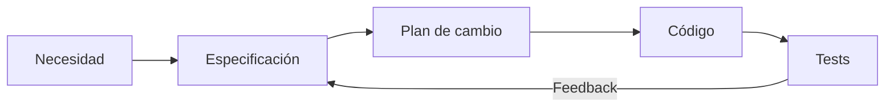
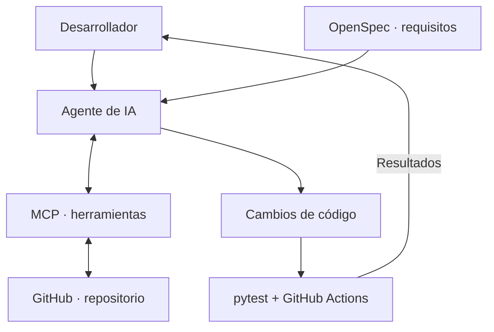
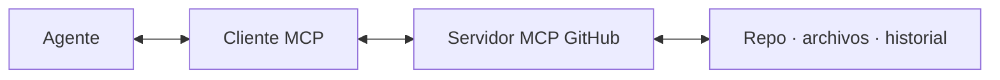
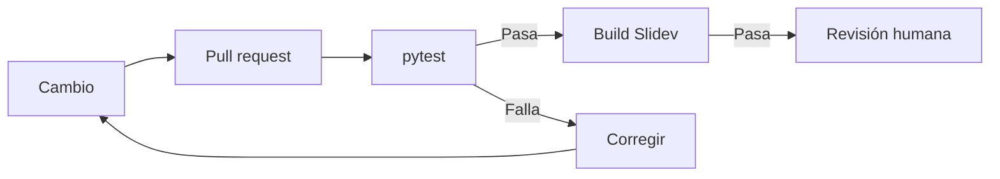

<div class="eyebrow">DEVOPS CHILE WORKSHOPS <span>×</span> TERRALITH LABS</div>

# De Prompts a <span class="accent">Agentes</span>

## Ingeniería de Software con IA, OpenSpec y MCP

<div class="hero-flow"><span>Prompt</span><b>→</b><span>Spec</span><b>→</b><span>Agente</span><b>→</b><span>Tests</span></div>

<div class="slide-note">21 OCT 2026 · WORKSHOP CON DEMOS EN VIVO</div>

---
layout: default
---

<div class="eyebrow">01 / EL PROBLEMA</div>

# La IA escribe código rápido. <span class="accent">¿Pero el correcto?</span>

<div class="two-col">
<div class="panel">
  <div class="panel-label">VELOCIDAD</div>
  <div class="big-number">≈ segundos</div>
  <p>Para generar un primer borrador.</p>
</div>
<div class="panel">
  <div class="panel-label">INCERTIDUMBRE</div>
  <p>¿Quién es dueño del dominio?</p>
  <p>¿Qué pasa si está duplicado?</p>
  <p>¿Cómo sabemos que funciona?</p>
</div>
</div>

<div class="takeaway">Generar código no es lo mismo que verificar requisitos.</div>

---
layout: default
---

<div class="eyebrow">02 / PROMPTS</div>

# Un pedido. <span class="accent">Muchas interpretaciones.</span>

<div class="prompt-card">“Crea una API para gestionar dominios de hosting.”</div>

<div v-click class="three-col">
<div class="mini-panel"><strong>Propiedad</strong><p>¿Un dominio puede tener dos dueños?</p></div>
<div class="mini-panel"><strong>Errores</strong><p>¿404, 409 o 500?</p></div>
<div class="mini-panel"><strong>Calidad</strong><p>¿Dónde están los tests?</p></div>
</div>

<div v-click class="takeaway">El agente completa los vacíos con supuestos. Hagamos explícitos esos vacíos.</div>

---
layout: default
---

<div class="eyebrow">03 / SPEC-DRIVEN DEVELOPMENT</div>

# Del prompt a <span class="accent">criterios verificables</span>

<div class="two-col">
<div class="panel">
<div class="panel-label">ANTES · INSTRUCCIÓN AMBIGUA</div>

```text
Crea una API de dominios.
```
</div>
<div class="panel">
<div class="panel-label">DESPUÉS · CONTRATO</div>

```text
Un dominio tiene una sola cuenta.
Duplicados → HTTP 409.
Cuenta inexistente → HTTP 404.
Cada regla tiene una prueba.
```
</div>
</div>

<div class="takeaway">La especificación define el resultado esperado, no solo la tarea.</div>

---
layout: default
---

<div class="eyebrow">04 / OPENSPEC</div>

# Intent → Spec → <span class="accent">Implementación → Validación</span>



<div class="two-col compact">
<div class="panel"><div class="panel-label">ESPECIFICACIÓN DEL DEMO</div><code>openspec/specs/domain-management.md</code></div>
<div class="panel"><div class="panel-label">NUEVO CAMBIO</div><code>openspec/changes/transfer-domain/proposal.md</code></div>
</div>

---
layout: default
---

<div class="eyebrow">05 / ARQUITECTURA</div>

# Un agente necesita <span class="accent">contexto y controles</span>



<div class="takeaway">La persona define el objetivo. Las fuentes informan. Las pruebas validan.</div>

---
layout: default
---

<div class="eyebrow">06 / MODEL CONTEXT PROTOCOL</div>

# MCP conecta herramientas. <span class="accent">No garantiza verdad.</span>



<div v-click class="three-col">
<div class="mini-panel"><strong>Consultar</strong><p>Leer código y especificaciones.</p></div>
<div class="mini-panel"><strong>Actuar</strong><p>Usar herramientas autorizadas.</p></div>
<div class="mini-panel"><strong>Verificar</strong><p>Contrastar con tests y revisión.</p></div>
</div>

---
layout: default
---

<div class="eyebrow">07 / DEMO EN VIVO · 3 MIN</div>

# Demo 1: <span class="accent">solo prompt</span>

<div class="prompt-card">“Implementa una API para registrar dominios de clientes de hosting.”</div>

<div class="two-col compact">
<div class="panel"><div class="panel-label">OBSERVA</div><p>Qué reglas inventa o presupone el agente.</p></div>
<div class="panel"><div class="panel-label">PREGUNTA</div><p>¿Qué no podríamos aprobar en un code review?</p></div>
</div>

<div class="command">Sin especificación previa. No asumir que la salida es correcta.</div>

---
layout: default
---

<div class="eyebrow">08 / DEMO EN VIVO · 6 MIN</div>

# Demo 2: <span class="accent">Spec + MCP + tests</span>

<div class="step-list">
<div><b>01</b> Leer <code>openspec/specs/domain-management.md</code></div>
<div><b>02</b> Consultar el repositorio con GitHub MCP</div>
<div><b>03</b> Pedir criterios de aceptación antes de editar</div>
<div><b>04</b> Ejecutar <code>pytest -q</code> y revisar resultados</div>
</div>

<div class="takeaway">El objetivo no es una respuesta convincente: es comportamiento comprobable.</div>

---
layout: default
---

<div class="eyebrow">09 / CI/CD</div>

# El pipeline es nuestro <span class="accent">filtro de evidencia</span>



<div class="command">GitHub Actions: <code>.github/workflows/ci.yml</code></div>

---
layout: default
---

<div class="eyebrow">10 / EJERCICIO · TRANSFERENCIA DE DOMINIO</div>

# Ahora te toca <span class="accent">especificar el cambio</span>

<div class="step-list">
<div><b>01</b> Leer la propuesta de transferencia</div>
<div><b>02</b> Definir reglas y casos límite</div>
<div><b>03</b> Implementar endpoint y pruebas</div>
<div><b>04</b> Ejecutar CI y explicar los resultados</div>
</div>

<div class="takeaway">Condición: el dominio cambia de cuenta sin duplicarse.</div>

---
layout: default
---

<div class="eyebrow">11 / IDEAS PARA LLEVARSE</div>

# No es magia. <span class="accent">Es ingeniería.</span>

<div class="three-col">
<div class="mini-panel"><strong>Spec</strong><p>Reduce ambigüedad.</p></div>
<div class="mini-panel"><strong>MCP</strong><p>Aporta contexto y herramientas.</p></div>
<div class="mini-panel"><strong>Tests</strong><p>Producen evidencia verificable.</p></div>
</div>

<div class="takeaway">IA acelera la implementación. El proceso determina la confiabilidad.</div>

---
layout: default
---

<div class="eyebrow">12 / RECURSOS</div>

# Clona. Experimenta. <span class="accent">Comparte.</span>

<div class="repo-link">github.com/gseriche/agentic-software-engineering</div>

```bash
git clone https://github.com/gseriche/agentic-software-engineering.git
cd agentic-software-engineering/demo
pip install -r requirements.txt
pytest -q
```

<div class="slide-note">DEVOPS CHILE WORKSHOPS × TERRALITH LABS · 21 OCT 2026</div>
